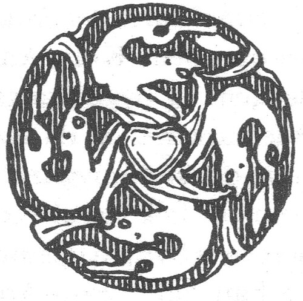

# Freyja - Crude Dynamo Ring Prototype



This project demonstrates a minimal in-memory Dynamo-style consistent hashing ring with single-token-per-node membership.  Similar to BigTable, DynamoDB, and Cassandra, for distribution.  We don't persist any data to disk.
The idea is the tracking server instances in a region form a group where they have a shared memory of user sessions.


## What is implemented

- Add/remove/list ring nodes in-memory
- Deterministic token generation per node (`id@host:port`)
- Key lookup to primary owner with ring wrap-around
- Preference list generation using configurable replication factor
- Optional periodic node sync from a remote URL
- HTTP endpoints for quick manual testing

## Endpoints

- `POST /ring/nodes` - add node
- `DELETE /ring/nodes/{id}` - remove node
- `GET /ring` - list ring nodes (sorted by token)
- `GET /ring/locate?key=...` - resolve key to primary + preference list

### Example request

`POST /ring/nodes`

```json
{
  "id": "node-a",
  "host": "127.0.0.1",
  "port": 9001
}
```

## Configuration

`src/main/resources/application.properties`

```properties
freyja.ring.replication-factor=3
freyja.ring.sync-enabled=false
freyja.ring.nodes-url=
freyja.ring.sync-interval-ms=30000
```

When sync is enabled, the app periodically GETs `freyja.ring.nodes-url` and reconciles local membership to exactly match the remote list.

Expected remote payload:

```json
[
  { "id": "n1", "host": "10.0.0.1", "port": 9001 },
  { "id": "n2", "host": "10.0.0.2", "port": 9001 }
]
```

## Notes / limitations

- Single process and in-memory only (no gossip, no persistence)
- Single token per node (no virtual nodes yet)
- No hinted handoff, quorum (`R/W`), or failure detector yet
- Sync fetch failures are logged and retried at next interval
